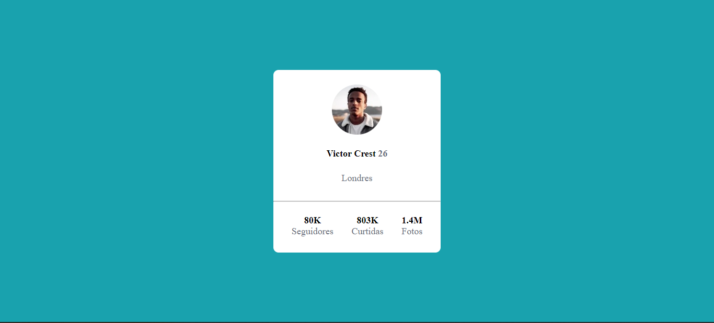

# Cartão de Perfil
 

 

## Projeto
O projeto é basicamente um card que contém algumas informações de uma pessoa fictícia. Tendo como objetivo colocar em prática questões como estruturação, nomeação de classes, estilização e posicionamento de elementos.  

## Tecnologias
- HTML5
- CSS3
- Flexbox

## Consideração
Este foi um desafio do curso Dev Quest para praticarmos o que aprendemos nos módulos de HTM e CSS (básico ao avançado pt.2).
 
Montar a estrutura HTML foi um pouco mais simples do que pensava, tive que me atentar um pouco para poder usar as tag corretas e um pouco mais semânticas (`<main>`) que foram apresentadas no curso.
 
Em relação ao CSS (minhar maior dificuldade), fiquei surpresa por conseguir desenvolver e entender o que estava fazendo. Pois uma coisa que sempre me deixava confusa era a questão de margin e padding, além da parte de posicionamento de elementos (flexbox), não entendia e mal conseguia aplicar. Mas após as aulas, revisões e várias outras explicações puder compreender bem, ainda fico um pouco perdida e preciso consultar minhas anotações, mas no geral consigo desenvolver bem, comparado com a um mês atrás.
